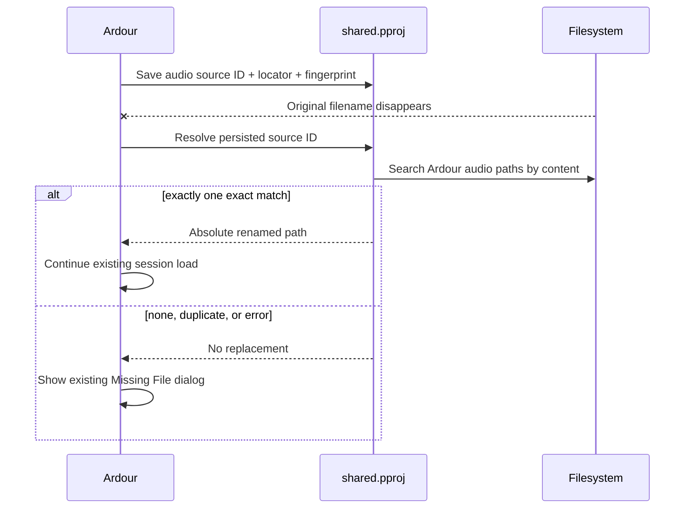

# PostProject Ardour pilot

This repository maintains an experimental patch series that lets
[Ardour](https://ardour.org/) record file-backed audio in an explicitly
selected [PostProject](https://postproject.org/) production and recover a
renamed source by content. It exercises PostProject's installed `pkg-config`
package and exception-enabled C++17 projection in an audio application.

This is not an Ardour fork. `UPSTREAM` pins one reviewed Ardour revision;
`patches/` contains the small integration on top. The work has not been
proposed to or reviewed by the Ardour maintainers.

## Behavior

Set `ARDOUR_POSTPROJECT_PRODUCTION` to an existing production before starting
Ardour. Without that variable, without the optional package at build time, or
with `--no-postproject`, Ardour follows its upstream path.

```sh
export ARDOUR_POSTPROJECT_PRODUCTION=/show/audio/shared.pproj
./ardour/gtk2_ardour/ardev /show/audio/mix-session
```

The integration follows this flow:



After a successful session save, each regular `AudioFileSource` is recorded
with revision origin `org.ardour` and an `org.ardour:source_id` identifier.
An exact locator already owned by one asset is adopted; content equality alone
never merges assets. A subsequent save confirms a moved locator and observes
the present content.

During session load, Ardour passes the missing source's persisted ID to the
adapter. PostProject searches Ardour's audio search paths and the old parent
directory. Only one content-verified candidate at a known locator or an exact
discovered match is accepted. The adapter does not choose between duplicate
files, and catches `postproject::Exception` at the UI boundary so database,
fingerprint, and package errors preserve Ardour's existing dialog.

The patches are intentionally narrow:

| Patch | Change |
|---|---|
| `0001` | Let a missing-file callback provide an exact renamed path |
| `0002` | Record and resolve single-file audio through PostProject |
| `0003` | Connect saves and missing-source recovery when the package exists |
| `0004` | Pass Ardour's persisted source ID into recovery |
| `0005` | Add the explicit upstream-only build switch |
| `0006` | Record the pilot source licences |
| `0007` | Accept a later content-verified known locator |

## Build and test

Install PostProject to a prefix without invoking Cargo from Ardour:

```sh
git clone https://github.com/postproject-org/postproject
(cd postproject &&
  cargo build --release --locked -p postproject-ffi &&
  cmake -S . -B target/package \
    -DPOSTPROJECT_LIBRARY="$PWD/target/release/libpostproject.so" \
    -DPOSTPROJECT_STATIC_LIBRARY="$PWD/target/release/libpostproject.a" \
    -DCMAKE_INSTALL_PREFIX="$PWD/../install" &&
  cmake --install target/package)

tools/checkout.sh
tools/build.sh install
tools/test.sh install
```

`tools/test.sh` compiles the same resolver source using only flags from
`postproject.pc`. Its executable creates valid one-second, 48 kHz stereo WAV
audio, records it, renames it, resolves the new name by content, adds a second
content-identical file, and verifies that ambiguity has no automatic winner.
It also catches a typed PostProject exception. Set `POSTPROJECT_ABI_TRACE` to
collect the operations exercised by that scenario.

To prove the integration is optional, build the same patch series without it:

```sh
tools/build.sh none
```

The Linux CI job compiles the full pinned Ardour both ways. A second job runs
the installed-package resolver scenario on macOS; it does not claim a full
macOS Ardour application build.

## Working on the patches

`tools/checkout.sh` creates `./ardour` at the pinned revision and applies each
entry from `patches/series` as a commit on `postproject-pilot`. Work and commit
inside that tree, then regenerate the outer patch series:

```sh
tools/export.sh
```

To update the upstream pin, change both values in `UPSTREAM`, rebase the nested
branch, regenerate the series, and re-check every source claim in `BRIEF.md`.

## Limitations and removal

The selected production is currently an environment variable, not an Ardour
preference. Fingerprinting on save and content search during the synchronous
missing-file callback can take noticeable time for large sessions or broad
search paths. MIDI, silent, playlist, and non-file sources are unchanged. The
pilot records completed audio sources but does not treat peak caches, bounces,
or freezes as managed jobs.

Remove the integration by unsetting the environment variable, configuring
with `--no-postproject`, or using upstream Ardour. Ardour session XML has no
PostProject extension and needs no migration; the separate `.pproj` can be
deleted independently.

## License

The patch and helper sources are licensed `GPL-2.0-or-later`, matching Ardour.
